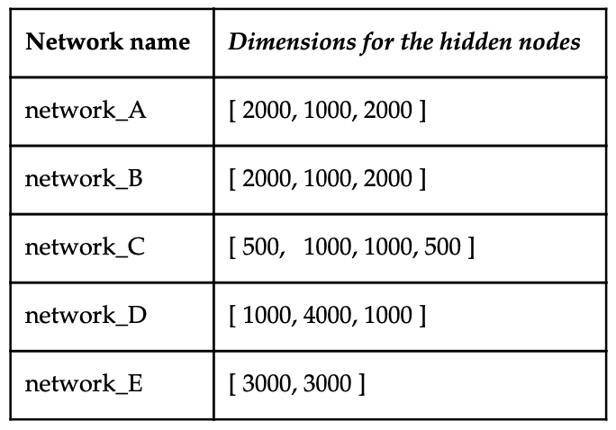
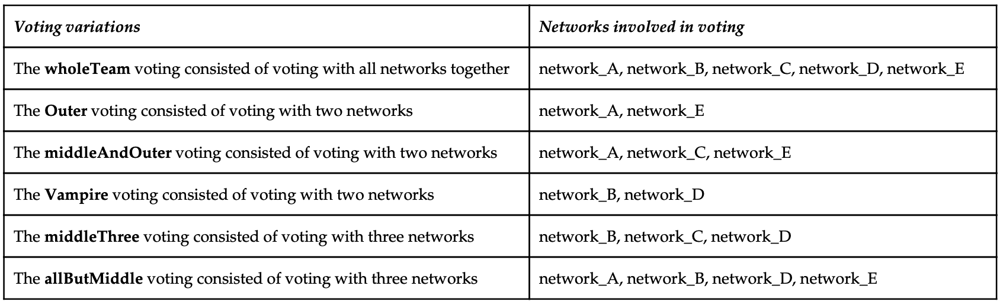
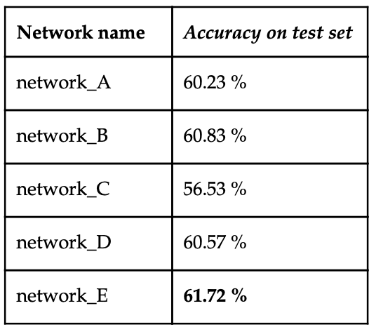
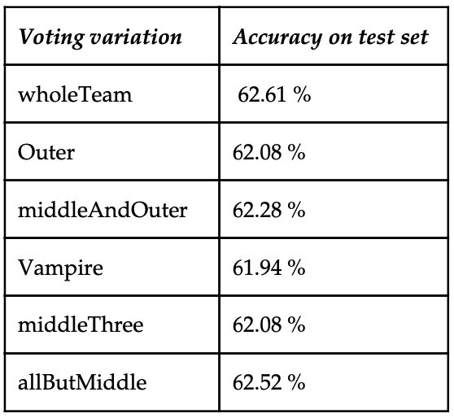

### Ensemble Neural network for image classification

##### **Intro:**
Created an multi layer neural network from scratch and then used different architectural versions of that code to build an ensemble learner, which I fine tuned to get a guessing accuracy of 62.61 % on the cifar-10 dataset. 

I trained these 5 different networks:

I used a stationary windows computer for the bonus-task. Even if the hardware specifications of the computer were good (cpu: i7 6600, gpu: gtx 2070 ,and 16 GB of ram) the ensemble training took more than 14 hours to complete.
then I used 6 different voting variations:

##### results

Below: a table showing the results for the individual accuracy scores on the test data. the higest individual accuracy score on the test data was 61.72 %

Below: a table showing the results for the different ensemble voting variations accuracy scores on the test data

This attempted improvement was successful. Just by taking an average of the individual accuracies for each model we get the number 59,976 %. But when using these models on an aggregated vote process in function ​ComputeEnsambkeAcc ​we get an accuracy of ​ 62.61 %​ on the test set using the wholeTeam voting variation, which is larger than the individual average test accuracy. Thus improving significantly from last improvement with 61,3%​ % ​to ​62.61 %

